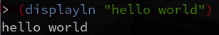

<style>
.firstbody {
    border: 1px solid black;
    page-break-after: always;
    padding: 5px;
    height: 870px;
}
.body {
    border: 1px solid black;
    page-break-after: always;
    padding: 5px;
    height: 1020px;
}
table, th, td {
    border: 1px solid black;
}
</style>

<span style="font-size: 14pt">实验课程名称：<ins>Android软件设计</ins></span>

<!-- width 15.6-->
<table width="100%">
    <tr>
    <td width="16%" text-align="center"><b>实验项目名称</td>
    <td colspan="3">Android多界面设计与控件运用综合实验作业</td>
    <td width="16%" text-align="center"><b>实验成绩</td>
    <td></td>
    </tr>
    <tr>
    <td text-align="center"><b>实 验 者</td>
    <td width="14%">王超睿</td>
    <td width="14%" text-align="center"><b>专业班级</td>
    <td width="18%">信息2002</td>
    <td text-align="center"><b>组    别</td>
    <td></td>
    </tr>
    <tr>
    <td text-align="center"><b>同 组 者</td>
    <td colspan="3"></td>
    <td text-align="center"><b>实验日期</td>
    <td></td>
    </tr>
</table>


<div class="firstbody">

<span style="font-size: 14pt">第一部分 实验预习报告</span>（包括实验目的、意义，实验基本原理与方法，主要仪器设备及耗材，实验方案与技术路线等）

### 一、实验作业目的

1. 通过实战操作，熟悉Android项目创建流程、多个界面的创建和跳转方法、基本布局的使用方法、常用控件的运用等，提升编程能力、分析问题和解决问题的能力，增强专业自信。

2. 结合2023年全国两会和2023年政府工作报告内容（学习链接：https://www.gov.cn/ ），融合到Android APP的设计过程中，主动学习国家最新的政策，了解国家大事，增进家国情怀意识。

### 二、实验作业内容与要求

1. 以2023年两会和2023年政府工作报告为主题，自行选择其中感兴趣的点或关心的领域，将相关内容进行梳理并展示到自行设计的Android APP中。

2. 创建Android项目，在多个界面中使用常用布局和常用控件（如：基本控件TextView、Button、EditText、ImageView、ProgressBar、AlertDialog和高级控件ListView、RecyclerView等）。要求：整个APP（含至少两个界面）总共至少使用到4种不同类型的基本控件且必须使用1种高级控件。

3. 设计稍微美观的APP界面，并能实现用户交互，能在模拟器或手机上运行程序。

### 三、预备知识

1. 安卓基础架构及项目环境搭建方法。

2. Activity的创建方法。

3. Android界面和布局使用方法。

4. Android常用控件的使用方法。

5. 仔细观看并学习“Android界面设计和常用控件”文件夹下的11份微视频。注：这些微视频主要以2023年政府工作报告中的一小部分内容为例开展。

### 四、实验设备及工具（包括软件调试工具）

硬件：PC机、Android手机

软件：Android Studio软件、Android手机

</div>


<div class="body">

<span style="font-size: 14pt">第二部分 实验过程记录</span>（可加页）（包括实验原始数据记录，实验现象记录，实验过程发现的问题等）

### 源代码

#### 主题颜色

```xml
<resources xmlns:tools="http://schemas.android.com/tools">
    <!-- Base application theme. -->
    <style name="Theme.Demo" parent="Theme.MaterialComponents.DayNight.DarkActionBar">
        <!-- Primary brand color. -->
        <item name="colorPrimary">#FF0000</item>
        <item name="colorPrimaryVariant">#FFD707</item>
        <item name="colorOnPrimary">@color/white</item>
        <!-- Secondary brand color. -->
        <item name="colorSecondary">#FF0000</item>
        <item name="colorSecondaryVariant">#FF9800</item>
        <item name="colorOnSecondary">#FFEB3B</item>
        <!-- Status bar color. -->
        <item name="android:statusBarColor">#B71C1C</item>
        <!-- Customize your theme here. -->
    </style>

    <style name="Theme.Demo.NoActionBar">
        <item name="windowActionBar">false</item>
        <item name="windowNoTitle">true</item>
    </style>

    <style name="Theme.Demo.AppBarOverlay" parent="ThemeOverlay.AppCompat.Dark.ActionBar" />

    <style name="Theme.Demo.PopupOverlay" parent="ThemeOverlay.AppCompat.Light" />
</resources>
```

#### Fragment

本项目两个界面是通过Fragment和Navigation实现的

##### First Fragment

该界面用5个CardView展示两会主页的大图，
因为数量少且固定，RecyclerView工作量较大（反正第二个界面还是用到了），
所以选择了固定的5个CardView的方案

```xml
<androidx.constraintlayout.widget.ConstraintLayout xmlns:android="http://schemas.android.com/apk/res/android"
    xmlns:app="http://schemas.android.com/apk/res-auto"
    xmlns:tools="http://schemas.android.com/tools"
    android:layout_width="match_parent"
    android:layout_height="match_parent"
    tools:context=".FirstFragment">

    <ScrollView
        android:layout_width="0dp"
        android:layout_height="0dp"
        app:layout_constraintBottom_toBottomOf="parent"
        app:layout_constraintEnd_toEndOf="parent"
        app:layout_constraintStart_toStartOf="parent"
        app:layout_constraintTop_toTopOf="parent">

        <LinearLayout
            android:layout_width="match_parent"
            android:layout_height="wrap_content"
            android:orientation="vertical">

            <androidx.cardview.widget.CardView
                android:layout_width="match_parent"
                android:layout_height="wrap_content"
                android:layout_marginHorizontal="16dp"
                android:layout_marginTop="16dp"
                android:layout_marginBottom="8dp"

                app:cardCornerRadius="8dp"
                app:cardElevation="8dp">

                <LinearLayout
                    android:id="@+id/card0"
                    android:orientation="vertical"
                    android:layout_width="match_parent"
                    android:layout_height="wrap_content"
                    android:foreground="?android:attr/selectableItemBackground">
                    <ImageView
                        android:layout_width="match_parent"
                        android:layout_height="wrap_content"
                        android:layout_gravity="top"/>

                    <TextView
                        android:layout_width="match_parent"
                        android:layout_height="wrap_content"
                        android:layout_gravity="bottom"
                        android:paddingHorizontal="8dp"
                        android:paddingVertical="4dp"
                        android:textSize="14sp" />
                </LinearLayout>
            </androidx.cardview.widget.CardView>

            <!-- 这里还有四个仅id不同的CardView -->

        </LinearLayout>
    </ScrollView>

</androidx.constraintlayout.widget.ConstraintLayout>
```

五个大图的子标题和图片通过Jsoup解析官网HTML获取，
并为点击事件设置通过Intent访问浏览器的行为

```kotlin
class FirstFragment : Fragment() {
    ...

    override fun onViewCreated(view: View, savedInstanceState: Bundle?) {
        super.onViewCreated(view, savedInstanceState)
        getHtmlFromWeb()
    }

    private fun getHtmlFromWeb() {
        val card = listOf(
            binding.card0,
            binding.card1,
            binding.card2,
            binding.card3,
            binding.card4
        )
        Thread {
            val stringBuilder = java.lang.StringBuilder()
            val subtitleList: ArrayList<Triple<String, String, String>> = ArrayList()
            try {
                val doc: Document = Jsoup.connect("http://www.gov.cn/zhuanti/2023qglh/index.htm").get()
                val images: Elements = doc.select("div[class=pannel-image]")
                val subtitles: Elements = doc.select("div[class=subtitle]")
                // class="item slidesjs-slide"
                Log.d("slides", images.toString())
                Log.d("slides", subtitles.toString())
                for (i in 0 until images.size) {
                    val image = images[i].select("img")
                    val link = subtitles[i].select("a[href]")
                    Log.d("img", image.toString())
                    Log.d("link", link.toString())
                    subtitleList.add(Triple(link.text(), link.attr("href"), image.attr("src")))
                }
            } catch (e: IOException) {
                stringBuilder.append("Error: ").append(e.message).append("\n")
            }
            activity?.runOnUiThread {
                for (i in 0..4) {
                    val imageView = card[i].getChildAt(0) as ImageView
                    val imageSrc = "http://www.gov.cn" + subtitleList[i].third
                    Log.d("img", imageSrc)
                    imageView.load(imageSrc)
                    val textView = card[i].getChildAt(1) as TextView
                    textView.text = subtitleList[i].first
                    card[i].setOnClickListener { it ->
                        val intent = Intent(Intent.ACTION_VIEW, Uri.parse(subtitleList[i].second))
                        startActivity(intent)
                    }
                }
            }
        }.start()
    }
}
```

#### 界面切换

从第一界面到第二界面的切换通过Menu实现

```kotlin
class MainActivity : AppCompatActivity() {
    ...

    override fun onOptionsItemSelected(item: MenuItem): Boolean {
        return when (item.itemId) {
            R.id.action_links -> {
                findNavController(R.id.nav_host_fragment_content_main).navigate(R.id.action_FirstFragment_to_SecondFragment)
                true
            }
            else -> super.onOptionsItemSelected(item)
        }
    }
}
```

#### Second Fragment

第二界面通过RecyclerView动态显示整个页面的链接

```xml
<androidx.constraintlayout.widget.ConstraintLayout xmlns:android="http://schemas.android.com/apk/res/android"
    xmlns:app="http://schemas.android.com/apk/res-auto"
    xmlns:tools="http://schemas.android.com/tools"
    android:layout_width="match_parent"
    android:layout_height="match_parent"
    tools:context=".SecondFragment">

    <androidx.recyclerview.widget.RecyclerView
        android:id="@+id/recycler_view"
        android:layout_width="0dp"
        android:layout_height="0dp"
        app:layout_constraintBottom_toBottomOf="parent"
        app:layout_constraintEnd_toEndOf="parent"
        app:layout_constraintStart_toStartOf="parent"
        app:layout_constraintTop_toTopOf="parent" />
</androidx.constraintlayout.widget.ConstraintLayout>
```

```xml
<FrameLayout xmlns:android="http://schemas.android.com/apk/res/android"
    android:layout_width="match_parent"
    android:layout_height="64dp"
    android:gravity="center_vertical"
    android:foreground="?android:attr/selectableItemBackground">

    <TextView
        android:id="@+id/itemTextView"
        android:paddingVertical="8dp"
        android:paddingHorizontal="16dp"
        android:textSize="16sp"
        android:textColor="@color/black"
        android:layout_width="match_parent"
        android:layout_height="match_parent"/>
</FrameLayout>
```

每个条目显示链接文本，点击事件行为是通过Intent访问链接页面

Adapter如下

```kotlin
class LinkAdapter(private val context: Context, var data: List<Pair<String, String>>):
    RecyclerView.Adapter<RecyclerView.ViewHolder>() {

    override fun onCreateViewHolder(parent: ViewGroup, viewType: Int): RecyclerView.ViewHolder {
        val itemView: View = LayoutInflater.from(context).inflate(R.layout.item, parent, false)
        return LinkHolder(itemView)
    }

    override fun getItemCount(): Int {
        return data.size
    }

    override fun onBindViewHolder(holder: RecyclerView.ViewHolder, position: Int) {
        val linkHolder: LinkHolder = holder as LinkHolder
        linkHolder.itemView.setOnClickListener {
            val intent = Intent(Intent.ACTION_VIEW, Uri.parse(data[position].second))
            context.startActivity(intent)
        }
        linkHolder.textView.text = data[position].first
    }

    class LinkHolder(itemView: View) : RecyclerView.ViewHolder(itemView) {
        val textView: TextView = itemView.findViewById(R.id.itemTextView)
    }
}
```

Fragment如下

```kotlin
class SecondFragment : Fragment() {
    ...

    private var recyclerView: RecyclerView? = null

    override fun onViewCreated(view: View, savedInstanceState: Bundle?) {
        super.onViewCreated(view, savedInstanceState)

        getHtmlFromWeb()

        recyclerView = binding.recyclerView

        val linearLayoutManager = LinearLayoutManager(activity)
        linearLayoutManager.orientation = LinearLayoutManager.VERTICAL
        recyclerView?.layoutManager = linearLayoutManager

        val adapter = LinkAdapter(activity!!, listOf())
        recyclerView?.adapter = adapter
    }

    private fun getHtmlFromWeb() {
        Thread {
            val list = ArrayList<Pair<String, String>>()
            try {
                val doc: Document =
                    Jsoup.connect("http://www.gov.cn/zhuanti/2023qglh/index.htm").get()
                val links: Elements = doc.select("a[href]")
                for (link in links) {
                    if (link.text() == "") continue
                    var url = link.attr("href")
                    url = (if (url.startsWith("/")) "http://www.gov.cn" else "") + url
                    if (!URLUtil.isValidUrl(url)) continue
                    Log.d("name", link.text())
                    Log.d("url", url)
                    list.add(Pair(link.text(), url))
                }
            } catch (e: IOException) {
                Toast.makeText(activity, e.message, Toast.LENGTH_SHORT).show()
            }
            activity?.runOnUiThread {
                recyclerView?.swapAdapter(LinkAdapter(activity!!, list), false)
            }
        }.start()
    }
}
```

### 运行结果

第一界面如下



点击第二个CardView，会打开相应页面


右上角菜单有导航项，用于打开第二界面


第二界面为长菜单，是两会主页所有链接的文本


点击“政府工作报告”，会打开相应页面


<p align="right">教师签字________</p>

</div>


<div class="body">

<span style="font-size: 14pt">第三部分 结果与讨论</span>（可加页）

实验结果分析（包括数据处理、实验现象分析、影响因素讨论、综合分析和结论等）

### 结果分析

程序运行结果与预期一致，本次实验作业顺利完成

### 小结

通过本次实验，我熟悉了Kotlin语言和Android软件开发流程，
锻炼了资料查阅能力和代码调试能力，也了解了Android软件运行的机理。

本次最难的部分就是RecyclerView中ViewHolder和Adapter等概念的理解，
查阅了很多资料，最终克服了难题。Android开发过程需要理解概念才能写出好的程序。

</div>